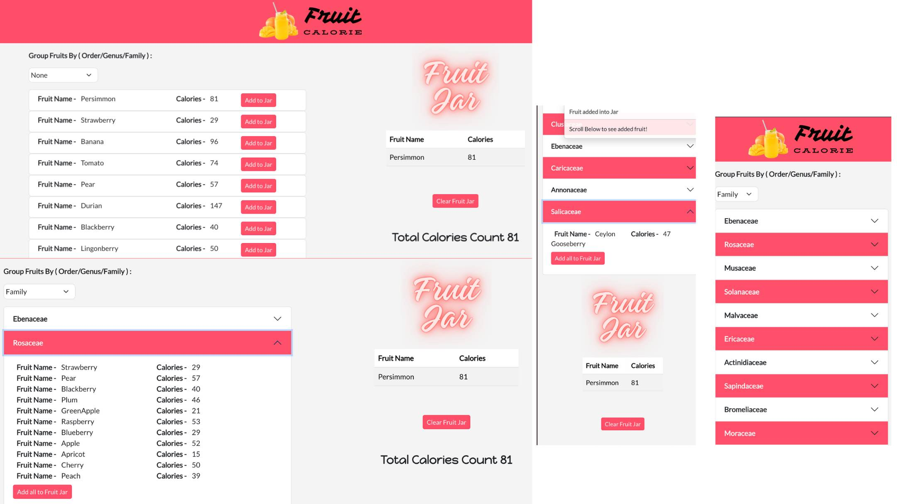

# [Fruit Calorie Application](https://fruit-calorie.netlify.app)

Welcome to the Fruit Calorie Application! This project is a coding exercise designed to showcase skills in React and TypeScript. The application displays a list of fruits fetched from the Fruityvice API and allows users to group, add, and manage fruits in a jar.
The application is deployed at - https://fruit-calorie.netlify.app

I have created a video presentation as well - `https://www.loom.com/share/96cfbfaa1e434241afaac638c1626f3d`

Web Application Screenshots - 


## Task Overview

The goal of this exercise is to create a basic React and TypeScript application with the following functionalities:

1. **Fetch Fruit Data**: Retrieve a list of fruits from the Fruityvice API.
2. **Display Fruits**: Show fruits grouped by a specified field with options to add individual fruits or entire groups to a jar.
3. **Manage Jar**: Display and manage selected fruits in a jar, including a total calorie count.

## Features

- **Data Fetching**: 
  - Use the Fruityvice API to fetch fruit data.
  - Base API URL: [Fruityvice API](https://www.fruityvice.com)

- **Layout**:
  - **Left Section**: Displays the list of fruits.
  - **Right Section**: Displays the jar with selected fruits.

- **Group By Functionality**:
  - **Group by** options: [None, Family, Order, Genus]
  - **None**: Flat list of fruits.
  - **Family, Order, Genus**: Collapsible list with headers based on the selected grouping.

- **Fruit List**:
  - Format: `{fruit name} ({amount of calories})`
  - Includes "Add" buttons for individual fruits and groups.

- **Jar Functionality**:
  - List of added fruits.
  - Total calorie count for the jar.

## Setup and Installation

1. Clone the repository:
   ```bash
   git clone https://github.com/sumitWebDev/fruitvice-app.git
2. Navigate to the project directory
   ```bash
   cd fruitvice-app
3. Install the dependencies:
   ```bash
   npm install
4. Start the development server:
   ```bash
   npm start
5. Open your browser and navigate to http://localhost:3000 to view the application or navigate to https://fruit-calorie.netlify.app/ where the application is deployed

## Packagaes Used 

1. React Bootsrap for UI styling


